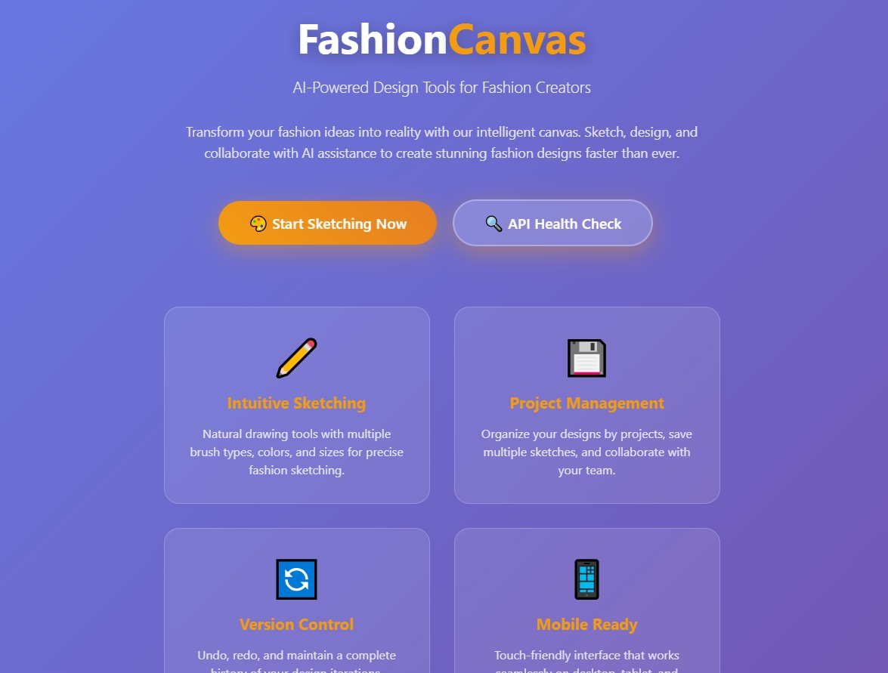

# Suanfamama fashion designer agent (sample 7)



## Vision
Build the best tool for fashion designers: an AI-native copilot that turns inspiration into production-ready outputs—faster, smarter, and more collaborative.

## 🎨 Canvas Sketching Feature
**NEW!** Fashion designers can now use our interactive canvas to sketch their ideas directly in the browser!

### Canvas Features:
- **Multiple Tools**: Pencil, brush, and eraser for different sketching styles
- **Color Palette**: 8 carefully selected colors for fashion design
- **Adjustable Sizes**: Brush sizes from 1px to 50px for precision
- **Project Management**: Organize sketches by project ID
- **Save & Load**: Persist your designs and load them later
- **Undo/Redo**: Full history tracking for design iterations
- **Mobile Ready**: Touch-friendly interface for tablets and phones

### Quick Start with Canvas:
```bash
# 1) Start the server
npm run dev

# 2) Open your browser to:
# Main page: http://localhost:3000
# Canvas: http://localhost:3000/canvas

# 3) Start sketching!
# - Enter a Project ID (e.g., "summer-collection-2024")
# - Choose your tools and colors
# - Draw your fashion ideas
# - Save with a descriptive name
```

## Positioning
- **Who**: Fashion designers, indie labels, and brand design teams moving from concept to production.
- **What**: A unified workspace for creative exploration and technical execution.
- **Why it's different**: Combines ideation (moodboards, sketching, silhouette exploration) with rigorous delivery (tech packs, grading, BOMs) in one flow. Integrates with tools designers already use while protecting proprietary IP.

## Core capabilities (initial)
- **🎨 Canvas Sketching**: Interactive drawing tools for fashion design ideation
- **Ideation**: Prompt-to-sketch, moodboard synthesis, silhouette exploration.
- **Spec automation**: Tech packs, measurement tables, grading suggestions, fit notes.
- **Material intelligence**: Fabric recommendations, sourcing hints, sustainability tags.
- **Collaboration**: Shared boards, comments, versioning.

## Product principles
- **Designer-first**: Clarity, speed, and delightful UX over knobs and raw models.
- **Trustworthy outputs**: Source-aware, reproducible, and reviewable.
- **Interoperability**: Plays well with Adobe, CLO3D, PLM, and common file formats.
- **Privacy & ownership**: Your data stays yours; opt-in sharing only.

## Next steps
- Read the project plan in `ROADMAP.md` and the system outline in `ARCHITECTURE.md`.
- Follow `SETUP.md` to prepare the development environment (includes npm registry fix).
- Create MVP issues from the roadmap and prioritize the first sprint.
- **Try the canvas!** Start sketching your fashion ideas at `/canvas`

## Quick start
```bash
# 1) Fix npm registry if needed (see SETUP.md)
# 2) Install dependencies
npm install

# 3) Start the API in dev mode
npm run dev

# 4) Open your browser
# Main page: http://localhost:3000
# Canvas: http://localhost:3000/canvas

# Health check
curl http://localhost:3000/health
```

## API Endpoints
- `GET /` - Landing page
- `GET /canvas` - Canvas sketching interface
- `GET /health` - Service health check
- `POST /api/sketches` - Save a new sketch
- `GET /api/sketches/:id` - Retrieve a sketch
- `GET /api/projects/:id/sketches` - List project sketches
- `DELETE /api/sketches/:id` - Remove a sketch